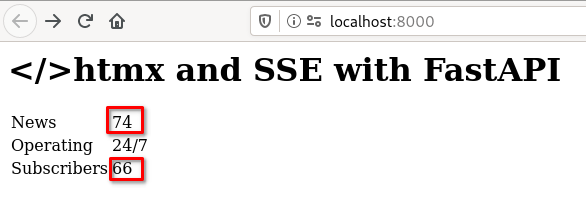

=========================
htmx and SSE with FastAPI
=========================
This is experiment testing FastAPI based web app sending Server Sent Events to frontend app created with htmx.

Installation
============
Using python 3.9 and having poetry installed::

    $ poetry install

Configuration
=============
There is nothing to configure.

Usage
=====
Activate virtual environment::

    $ poetry shell
    (.venv)$

Start the web app::

    (.venv)$ uvicorn app:app

Open http://localhost:8000 in a browser.

You shall see simple page with a table, where two cells are updating it's content according to events generated by the server.

Red rectangles show text, which is dynamically updated.

To test the events from command line::

    $ curl -N http://localhost:8000/status_updates
    event: #of_subscribers
    data: 0
    retry: 30000

    event: #of_subscribers
    data: 1
    retry: 30000

    event: #of_subscribers
    data: 2
    retry: 30000

    event: #of_subscribers
    data: 3
    retry: 30000

    event: #of_news
    data: 4
    retry: 30000

    event: #of_news
    data: 5
    retry: 30000
